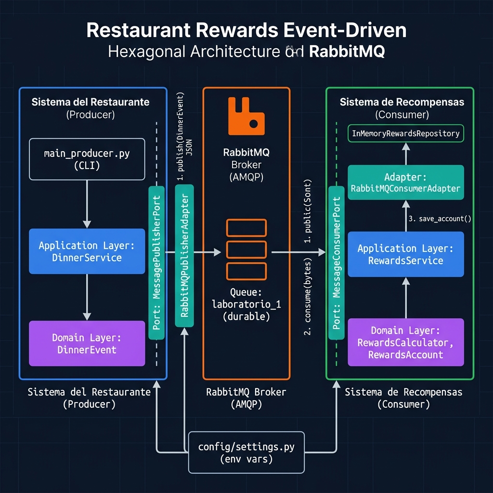

# Sistema de Recompensas de Restaurante

Sistema de fidelización basado en **Arquitectura Hexagonal** y **Arquitectura Orientada a Eventos (EDA)** con mensajería **RabbitMQ**.

---

## Arquitectura

Este proyecto implementa dos microservicios desacoplados que se comunican a través de un broker de mensajería RabbitMQ, siguiendo los principios de **Event-Driven Architecture (EDA)** y **Hexagonal Architecture (Ports & Adapters)**.

### Diagrama del sistema



---

## Patron Arquitectonico: Hexagonal + EDA

### Arquitectura Hexagonal

La **Arquitectura Hexagonal** (también llamada *Ports & Adapters*), propuesta por Alistair Cockburn, separa el núcleo de la aplicación (dominio y lógica de negocio) de los detalles de infraestructura (bases de datos, brokers de mensajes, frameworks). Esta separación se logra mediante:

- **Puertos (Ports):** Interfaces abstractas (`ABC`) que definen contratos que el dominio necesita del mundo exterior.
- **Adaptadores (Adapters):** Implementaciones concretas de los puertos para una tecnología específica (RabbitMQ, bases de datos, etc.).
- **Dominio (Domain):** Núcleo puro sin dependencias externas, fácilmente testeable en aislamiento.

### Arquitectura Orientada a Eventos (EDA)

La **Arquitectura Orientada a Eventos** permite desacoplar el productor del consumidor: el restaurante publica un evento al broker y no necesita saber quién lo procesa ni cuándo. Esto habilita:

- **Escalabilidad:** múltiples consumidores pueden procesar eventos en paralelo.
- **Resiliencia:** si el consumidor falla, los mensajes quedan en cola (durable) para su reprocesamiento.
- **Bajo acoplamiento:** productor y consumidor evolucionan de forma independiente.

---

## Estructura del Proyecto

```
restaurant_rewards/
├── config/
│   ├── __init__.py
│   └── settings.py             # Configuración centralizada (env vars)
│
├── producer/                   # Microservicio: Sistema del Restaurante
│   ├── domain/
│   │   └── models.py           # DinnerEvent — entidad de dominio pura
│   ├── application/
│   │   └── dinner_service.py   # Caso de uso: registrar y publicar cena
│   ├── ports/
│   │   └── message_publisher_port.py  # Puerto de salida (ABC)
│   ├── adapters/
│   │   └── rabbitmq_publisher_adapter.py  # Adaptador RabbitMQ
│   └── main_producer.py        # CLI de entrada
│
├── consumer/                   # Microservicio: Sistema de Recompensas
│   ├── domain/
│   │   ├── models.py           # DinnerEventMessage, RewardsAccount
│   │   └── rewards_calculator.py  # Lógica pura de cálculo de puntos/cashback
│   ├── application/
│   │   └── rewards_service.py  # Caso de uso: procesar evento y actualizar cuenta
│   ├── ports/
│   │   ├── message_consumer_port.py    # Puerto de entrada (ABC)
│   │   └── rewards_repository_port.py  # Puerto de repositorio (ABC)
│   ├── adapters/
│   │   ├── rabbitmq_consumer_adapter.py    # Adaptador RabbitMQ
│   │   └── in_memory_rewards_repository.py # Repositorio en memoria
│   └── main_consumer.py        # Punto de entrada del consumidor
│
├── tests/                      # Suite de pruebas automatizadas
│   ├── test_dinner_model.py
│   ├── test_dinner_service.py
│   ├── test_in_memory_repository.py
│   ├── test_rewards_calculator.py
│   ├── test_rewards_service.py
│   └── test_settings.py
│
├── docs/
│   └── architecture.png        # Diagrama de arquitectura
├── .env.example                # Plantilla de variables de entorno
├── .gitignore
├── pyproject.toml
├── requirements.txt
└── sonar-project.properties
```

---

## Flujo del Proceso

```
 Cliente come en restaurante
         |
         v
 [1] main_producer.py (CLI)
     └─► DinnerService.register_dinner(DinnerEvent)
              |
              |  via MessagePublisherPort (Puerto)
              v
 [2] RabbitMQPublisherAdapter
     └─► Publica JSON en cola configurada (durable)
              |
              v
 ┌──────────────────────────┐
 │   RabbitMQ Broker (AMQP) │
 └──────────────────────────┘
              |
              |  via MessageConsumerPort (Puerto)
              v
 [3] RabbitMQConsumerAdapter
     └─► Llama a RewardsService.process_dinner_event(bytes)
              |
              v
 [4] RewardsService
     ├─► RewardsCalculator.calculate_points()
     ├─► RewardsCalculator.calculate_cashback()
     └─► RewardsRepositoryPort.save_account()  (InMemoryRewardsRepository)
```

**Reglas de negocio activas:**
- **Puntos:** 10 puntos por cada unidad monetaria consumida.
- **Cashback:** 2 % del monto total consumido.

---

## Principios de Diseño Aplicados

| Principio | Evidencia |
|---|---|
| **Alta cohesion** | Cada clase tiene una única responsabilidad: `RewardsCalculator` solo calcula, `DinnerService` solo orquesta la publicación, los adaptadores solo manejan infraestructura. |
| **Bajo acoplamiento** | El `DinnerService` depende de `MessagePublisherPort` (interfaz), no de RabbitMQ. Cambiar de broker no requiere tocar el dominio. |
| **Modularidad** | Dos microservicios independientes (`producer/` y `consumer/`) con sus propias capas internas. |
| **Abstraccion** | Todos los detalles de infraestructura quedan detrás de ABCs (`MessagePublisherPort`, `MessageConsumerPort`, `RewardsRepositoryPort`). |
| **Inyeccion de dependencias** | Las dependencias se construyen en `main_*.py` (Composition Root) y se inyectan hacia abajo. |
| **Sin hardcodeo** | Todas las credenciales y parámetros de conexión se leen de variables de entorno via `config/settings.py`. |

---

## Requisitos

- Python 3.10+
- Docker y Docker Compose

---

## Ejecucion

1. **Levantar RabbitMQ:**
   ```bash
   docker-compose up -d
   ```

2. **Instalar dependencias:**
   ```bash
   python -m venv .venv
   source .venv/bin/activate
   pip install -r requirements.txt
   ```

3. **Ejecutar el Consumidor (en una terminal):**
   ```bash
   python -m consumer.main_consumer
   ```

4. **Ejecutar el Productor (en otra terminal):**
   ```bash
   python -m producer.main_producer
   ```

---

## Pruebas Automatizadas y Cobertura

```bash
pytest
```

Esto generará:
- Reporte en consola con líneas no cubiertas.
- `coverage.xml` para análisis en SonarCloud/SonarQube.

La cobertura objetivo es **>= 85 %** sobre las capas de dominio y aplicación (los `main_*.py` están excluidos de la medición por ser puntos de entrada CLI).

---

## Analisis Estatico — SonarCloud / SonarQube

El token de Sonar **nunca** se almacena en el repositorio. Se pasa como variable de entorno al ejecutar el scanner:

```bash
SONAR_TOKEN=<tu_token> sonar-scanner
```

Atributos de calidad evaluados:

| Atributo | Practica aplicada |
|---|---|
| **Reliability** | Manejo explícito de excepciones; nack/requeue ante fallos |
| **Security** | Sin credenciales en código; `.env` en `.gitignore` |
| **Maintainability** | Docstrings completos; módulos pequeños y cohesivos |
| **Duplications** | Código reutilizable via ports e inyección de dependencias |

---

## Autores

Proyecto desarrollado para el curso **CS3081 - Ingenieria de Software** — UTEC.
